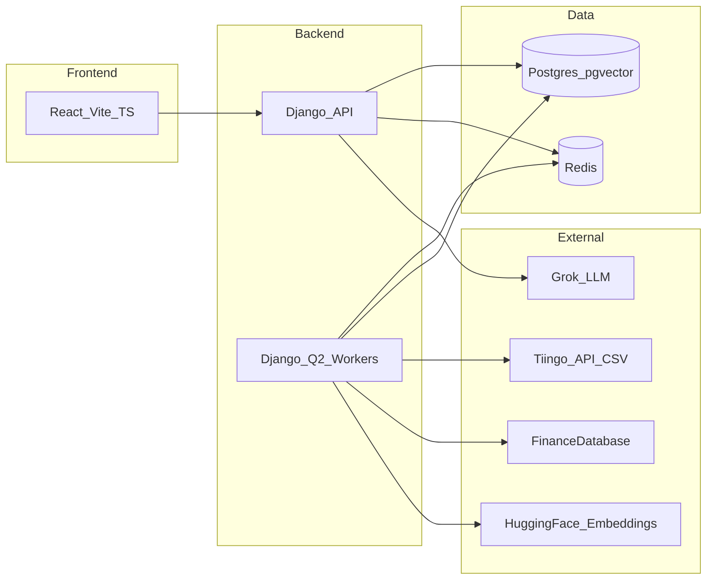

# Guniea Pig Portfolio — Technical plan

**Guniea Pig Portfolio** is the product name for this application (use it in user-facing copy, repo descriptions, and deployment labels).

End-to-end architecture: React/Vite/Django, Tiingo + FinanceDatabase asset spine with Hugging Face + pgvector RAG, multi-year KMeans hidden-risk analytics, long-horizon vol surges, Grok narratives, Docker/GCP, Django Q2 + Redis.

---

## 1. Executive summary

**Guniea Pig Portfolio** is an **interactive portfolio simulation** product: **~5 years of adjusted historical prices** (Tiingo), **multi-year “hidden risk”** via return-based **KMeans** clusters, **long-horizon volatility surge** signals, **semantic asset search** (embeddings + **pgvector**), and **Grok** for plain-language explanation—not for inventing numbers or trades. **Target users think in years**, not days; copy and batch jobs should reflect that.

**Stack (locked direction):** **React (TS) + Vite + Tailwind + Recharts** · **Django (Ninja)** API · **PostgreSQL + pgvector** · **Redis + Django Q2** · **Docker Compose** (Nginx, Gunicorn, services) · **GCP** deployment; TLS via **managed certs / LB** or **Certbot**—choose one path to avoid double termination.

**Data spine:** Tiingo **master list CSV** (`ticker`, `exchange`, `assetType`, `priceCurrency`, `startDate`, `endDate`) + price history; **FinanceDatabase** enriches metadata; **identifier ladder** (not a naive ticker join); embeddings via **`sentence-transformers/all-MiniLM-L6-v2`** (384d) into **pgvector** for RAG.

---

## 2. Product principles

- **Long-term framing:** Metrics and UI emphasize **multi-year** co-movement and **long-run** risk vs norms—not day-trading language.
- **Explainable ML:** Clusters, concentration, and surge rules are **auditable**; Grok **narrates** structured JSON from the backend.
- **Simulation / education:** Positioning as **research, not personalized investment advice** unless you later meet licensing requirements.

---

## 3. System architecture

| Layer            | Choice                                                                           |
| ---------------- | -------------------------------------------------------------------------------- |
| UI               | React + TypeScript + Vite + Tailwind; **Recharts** (optional thin chart wrapper) |
| API              | Django (**Ninja**) + Gunicorn                                                    |
| Jobs             | **Django Q2** + Redis (locked); idempotent tasks, timeouts, logs/DB job status   |
| DB               | PostgreSQL + **pgvector**                                                        |
| Caching / broker | Redis                                                                            |
| Deploy           | Docker Compose locally; **one GCP VM** in prod; **Nginx** reverse proxy          |

**Tasks vs Celery:** **Celery** was considered; **Q2 + Redis** stays for simpler ops. Revisit Celery only if you need heavy multi-queue pools and mature ops patterns.

### Repo layout & GCP shape (locked)

- **GCP:** A **single Compute Engine VM** (one instance) runs **Docker Compose** (services: Nginx, Django/Gunicorn, Postgres+pgvector, Redis, Q2 workers, etc.)—matches **Certbot + Nginx** on the same host.
- **Repository:** **One root project directory** (monorepo) with separate top-level apps:
  - **`backend/`** — Django API, Q2 tasks, ML helpers, `manage.py` tree.
  - **`frontend/`** — React + Vite + TypeScript + Tailwind.
- Add **`docker/`** (Compose files, optional `nginx/` configs) at repo root when you scaffold—keep orchestration next to both apps.

_Naming:_ If you prefer **`django/`** instead of **`backend/`**, use that; the important part is **one repo**, **two app trees**, **one VM** in prod.

### HTTPS: Certbot (Let’s Encrypt) vs GCP-managed

**Certbot path (common for a single VM running Docker Compose + Nginx):**

- Point **`A` DNS** for your domain to the VM’s public IP.
- **Nginx** terminates TLS using certs issued by **Certbot** (Let’s Encrypt). Typical flow: `certbot` with **HTTP-01** (needs **port 80** open for the challenge) or **DNS-01** if HTTP-01 is awkward (e.g. wildcards, strict firewalls).
- **Automating renewal (recommended patterns):**
  - **`certbot renew`** is idempotent: it only requests a new cert when the current one is within the renewal window (typically under **30 days** to expiry). Run it **often** (e.g. **twice daily**) so a failed run can retry tomorrow.
  - **Linux VM with systemd:** Prefer Certbot’s **`certbot.timer`** (ships with many packages)—it schedules renewals automatically. Verify with `systemctl status certbot.timer`.
  - **Cron (universal):** e.g. `0 3,15 * * * certbot renew --quiet --deploy-hook "systemctl reload nginx"` (adjust paths; use **`reload`** not **`restart`** to avoid dropping connections).
  - **`--deploy-hook`:** Run only when a cert was actually renewed—e.g. `nginx -s reload` or `docker compose exec nginx nginx -s reload` so Nginx always picks up new files.
  - **Dry run:** `certbot renew --dry-run` after initial setup to confirm HTTP-01/DNS-01 still works.
  - **Monitoring:** Alert if a cert is within **14 days** of expiry (backup alarm if automation fails).
  - **Docker:** If Nginx + Certbot are containerized, the **same** `certbot renew` + deploy-hook pattern applies—hook reloads the **Nginx** container or sends `SIGHUP` per your compose layout; share **`/etc/letsencrypt`** as a volume.

**GCP-managed path (alternative):**

- **HTTPS load balancer** + **Google-managed certificate** (or upload your own). No Certbot on the VM if the **LB** terminates TLS and forwards HTTP(S) to backends—then the VM can stay HTTP-only **behind** the LB (private network).

**Avoid double termination:** Do **not** terminate TLS at **both** a GCP LB **and** Certbot on the same request path unless you deliberately design **SSL proxy** chains. Choose **one** public TLS endpoint.

---

## 4. Data

| Source              | Role                                                                             |
| ------------------- | -------------------------------------------------------------------------------- |
| **Tiingo**          | **Source of truth** for **adjusted** historical prices and **master ticker CSV** |
| **FinanceDatabase** | **Enrichment**: names, sector, industry, country, etc.                           |
| **5-year history**  | **Backtests / simulation** paths; separate from ML feature-window length         |

**Tiingo CSV**

- Columns: `ticker`, `exchange`, `assetType`, `priceCurrency`, `startDate`, `endDate`.
- **No ISIN/CUSIP** in CSV—matching FD cannot assume stable cross-vendor IDs from Tiingo alone.
- **Natural key:** **`(ticker, exchange)`** (same symbol can appear on multiple venues with different dates).
- **Ingest:** periodic Q2 job: parse, upsert, checksum; use `endDate` for listing lifecycle.
- **Efficiency:** Do **not** call Tiingo per row for metadata—the CSV is enough for identity; use API quota for **price series** and documented bulk flows.

**Price jobs**

- Rate limits, pagination, **5-year backfill** strategy; optional raw response storage for audit.

### Why PostgreSQL (vs MongoDB for v1)

**PostgreSQL is the better default** for **Guniea Pig Portfolio**:

- **pgvector** is part of the plan—**vector search lives in Postgres**; Mongo would either duplicate that story (Atlas Vector Search) or force **two databases** and more ops.
- **Django** is strongest with **relational** backends; first-class ORM, migrations, and admin on Postgres.
- Domain data is **relational**: users, portfolios, holdings, assets, enrichment provenance, job runs, price bars—**joins, constraints, and transactions** matter.
- **Time-series-ish** price history fits **partitioned tables** or extensions (e.g. **TimescaleDB** on Postgres) if you outgrow plain tables—still one engine.

**MongoDB** can make sense for **document-heavy** or **flexible-schema** workloads at huge scale; here it would add a **second stack** without a clear win. Revisit only if a future workload (e.g. raw filings blobs) justifies a dedicated document store—and even then, **Postgres + JSONB** often suffices.

**Decision:** **Postgres-only** for application data, vectors, and (initially) historical prices.

---

## 5. Asset enrichment & RAG

**Problem:** Tiingo and FinanceDatabase **symbols align often but not always**—avoid a single SQL `JOIN ON ticker`.

**Identifier ladder (order)**

1. After match, **store ISIN/CUSIP** (etc.) **from FinanceDatabase** if returned.
2. **Composite:** normalized ticker + **exchange** + **assetType** + **priceCurrency** (+ date overlap).
3. **Symbol-only** with normalization; if multiple FD hits → **rank** or **`ambiguous`**.
4. **Name fuzzy** (low confidence, optional review queue).
5. **Manual overrides** table for repeat offenders.

**Provenance:** `enrichment_status` (`ok` / `partial` / `missing` / `ambiguous`), `match_method`, `match_confidence`. **Honest expectation:** strong hit rates on liquid US equities; weaker on OTC, ADRs, intl, many funds.

**Enrichment execution:** Batch/chunk FD calls; cache in Postgres; backoff; optional future **bulk ISIN** file.

**Embedding pipeline**

- Build one **deterministic sentence** per asset from Tiingo + enriched fields (template versioning).
- **sentence-transformers** in Q2 workers → **pgvector**; `embedding_text_hash` for invalidation.
- **Query:** user text → same model → nearest neighbors → UI + Grok context.
- **Grok:** Retrieves facts from **your DB**; does not invent tickers or weights.
- **Later:** optional extra chunks (filings) with separate vectors.

### Hugging Face embedding model (RAG) — locked

**v1 model:** **`sentence-transformers/all-MiniLM-L6-v2`** · **384 dimensions** · fast CPU-friendly embeds, small **pgvector** footprint.

Pin this id in app config; store **`embedding_model`** on each row. **Re-embed** the universe if you ever change model.

_Optional later (if retrieval quality is weak):_ `BAAI/bge-small-en-v1.5`, `all-mpnet-base-v2`, etc.—treat as a new migration + full re-embed, not a silent swap.

---

## 6. Portfolio simulation

- Use **5 years** of adjusted returns/prices to **simulate** user-defined portfolios.
- **Benchmark:** use **SPY** as the **primary baseline** for comparisons (e.g. excess return vs SPY, beta vs SPY, narrative context)—keep metrics **simple** in v1 (exact list TBD; e.g. cumulative return, max drawdown, volatility vs SPY optional).
- Distinct from **cluster feature windows** (below).

---

## 7. Hidden risk (clustering & concentration)

**Locked (v1)**

- **Feature window:** **3 years** of **weekly** log returns (adjusted prices)—**~156** weekly observations per name (define week boundary consistently, e.g. **Friday–Friday**).
- **Benchmark for comparisons:** **SPY** is the **single primary baseline** for betas, relative risk context, and simple performance comparisons unless you add secondary benchmarks (QQQ, etc.) later.

**Horizon**

- **Multi-year** mindset: refresh cluster model **monthly or quarterly** (not daily).

**Features**

- **Not raw price**—use **log returns** from adjusted prices.
- **Weekly only for v1** (locked above); daily features deferred unless you revisit.

**Method**

- **KMeans** on aligned return matrix → **cluster ID** per instrument in universe.
- **Caveat:** High correlation does not strictly equal same cluster; optional later: PCA, hierarchical on correlation distance.

**User-facing**

- **Cluster exposure:** sum weights by cluster → “% in one movement profile.”
- **Sector (fundamentals)** vs **cluster (returns)** side by side.
- **Cluster beta vs SPY:** define one rule (e.g. EW cluster return regressed on **SPY**)—same in API and Grok; **SPY** remains the reference index.
- **Diversification score 0–100:** penalize **economic** concentration (e.g. cluster Herfindahl / max cluster weight), not raw duplicate tick count.
- **Cluster map:** PCA (or UMAP) of feature space → 2D bubbles (size = weight, color = cluster).

**Actionability (v1, no optimizer)**

- Table: cluster → weight → beta tag.
- Top **drivers** per overweight cluster.
- **Reduce** (trim toward cap) + **add** shortlists from **underrepresented** clusters (universe + liquidity); RAG may **filter** names, not replace math.
- Grok narrates **structured JSON** only.

---

## 8. Volatility surge (long-horizon, simple)

**Skip Isolation Forest in v1.**

**Locked (v1)**

- **Metric:** **one-year rolling realized volatility** **σ_52** — annualized stdev of the last **52 weeks** of **weekly** log returns.
- **Baseline:** **multi-year** history (e.g. **3–5 years**) of past **σ_52** values for that asset; **median** = long-run norm.
- **SPY:** use **SPY’s σ_52** as context for **market-wide** vs **idiosyncratic** stress (optional flag when both spike).

- **Trigger:** ratio ≥ ~2× median **or** z ≥ ~3 vs multi-year distribution (pick one primary during implementation).
- **Ops:** **weekly/monthly** batch evaluation; **cooldowns** weeks–months; **liquidity** floor.
- **Grok:** numbers from backend, long-term wording.

---

## 9. Feature summary (user-visible)

| Feature                  | Description                                                            |
| ------------------------ | ---------------------------------------------------------------------- |
| **Portfolio simulation** | ~5y historical paths on Tiingo data                                    |
| **Hidden risk auditor**  | Multi-year clusters, concentration, diversification score, cluster map |
| **Vol surge alert**      | **σ_52** vs multi-year baseline; SPY context for regime                |
| **RAG asset search**     | Natural-language → pgvector over embedded asset sentences              |
| **Grok narratives**      | Explain clusters, surges, search results with disclaimers + citations  |

---

## 10. Security & compliance (baseline)

- Secrets: **GCP Secret Manager** (or equivalent).
- Rate limits + auth on costly routes (embeddings, backtests, Grok).
- **Not financial advice** unless licensed; Grok outputs disclaimers.

### Environment variables & Docker

**Are `.env` files put into Docker images by default?** **No.** An image only contains what the **Dockerfile** copies or generates. If you never `COPY .env` / `COPY .env.production`, the file is **not** in the image.

**Still do this:**

- Add **`.env` to `.gitignore`** and **`.dockerignore`** so secrets are not committed and not accidentally sent as build context.
- Commit a **`.env.example`** (same keys, dummy values) so developers know what to set.

**Docker Compose (local dev):** `env_file: .env` or `environment:` entries apply at **container run time** from the **host**—they inject variables into the process; that is **not** the same as baking a file into the image (unless a service `COPY`s it).

**Production (GCP):** Prefer **Secret Manager** (or your platform’s secret store) and mount values as **runtime env vars** (Cloud Run, GKE, etc.). Do not build secrets into CI logs or image layers.

**Django:** `DEBUG`, `SECRET_KEY`, DB URLs, API keys—load from environment only; use `django-environ` or similar pattern; never commit real keys.

---

## 11. Open items to tweak (pre-build)

1. **Universe:** v1 **curated ~100** list proposed—see [§14](#14-initial-asset-universe-v1-proposal); confirm Tiingo coverage + `assetType` rules (ETFs + stocks).
2. **Clustering:** **Locked:** 3y **weekly** log returns; still to pick **K** and refit schedule.
3. **Diversification:** Exact penalty formula and cluster weight caps for UI.
4. **Cluster beta:** Precise regression rule vs **SPY** (benchmark locked).
5. **Surge:** **Locked:** **σ_52** (weekly); still to pick ratio vs z threshold, baseline years (3–5y), cooldown length.
6. **FD matching:** Final ladder rules per FinanceDatabase’s actual API surface; manual review workflow or not.
7. **Embedding:** **Locked:** `sentence-transformers/all-MiniLM-L6-v2` (384d); still pick **pgvector** index type (IVFFlat/HNSW) at implementation.
8. **TLS:** Use **Certbot on Nginx** (VM) **or** **GCP-managed cert on LB**—see [HTTPS: Certbot vs GCP-managed](#https-certbot-lets-encrypt-vs-gcp-managed); one termination point.
9. **Backtest metrics:** Keep **simple**—e.g. cumulative return vs **SPY**, max drawdown; expand later if needed.

---

## 12. Suggested implementation phases

1. **Foundation:** Docker Compose, Django + Postgres + pgvector + Redis, React shell, CI stub.
2. **Assets:** Tiingo CSV ingest, FD enrichment ladder, asset table + provenance, sentence + embed + pgvector.
3. **Prices:** Historical sync job, 5y store, basic chart API.
4. **Simulation:** Portfolio CRUD + backtest over stored history.
5. **Risk:** Feature pipeline → KMeans → concentration + diversification + cluster map API + UI.
6. **Surge:** Batch vol job + notifications UI.
7. **RAG + Grok:** Search endpoint + LLM integration with structured prompts.

---

## 13. Before creating anything — what to decide up front

**Product / analytics (from §11 — at least pick defaults):**

| Topic                              | Why it matters early                                                                  |
| ---------------------------------- | ------------------------------------------------------------------------------------- |
| **Investable universe**            | Which Tiingo `assetType`s and regions are in v1—drives DB size, jobs, and UI scope.   |
| **Clustering**                     | **Locked:** 3y weekly returns; still **K** + refit cadence.                           |
| **Diversification + cluster beta** | Formulas; **SPY** locked as benchmark.                                                |
| **Surge**                          | **Locked:** σ_52; ratio vs z, baseline years, cooldowns.                              |
| **Backtest metrics**               | Keep simple vs **SPY** (details TBD).                                                 |
| **Embedding model**                | **Locked:** `all-MiniLM-L6-v2` (384d); index type IVFFlat/HNSW TBD.                   |
| **TLS strategy**                   | Certbot on VM vs GCP-managed on LB—drives infra repo layout, not Django code day one. |

**Platform & repo (decide or default before scaffolding):**

| Topic                 | Notes                                                                                                  |
| --------------------- | ------------------------------------------------------------------------------------------------------ |
| **GCP shape**         | **Locked:** **one VM** + Docker Compose—see [Repo layout & GCP shape](#repo-layout--gcp-shape-locked). |
| **Python + Node LTS** | Pin **Python** (e.g. 3.12) and **Node** (e.g. 20 LTS) in `Dockerfile` / `.tool-versions` / docs.       |
| **Monorepo layout**   | **Locked:** `backend/` (Django) + `frontend/` (React) under one repo root; optional `docker/`.         |
| **Auth v1**           | Session login vs JWT vs “no auth” for private alpha—drives Django middleware and React routes.         |
| **Domain**            | Final hostname for Tiingo/Grok **allowlists** and Certbot **CN/SAN** (can be staging + prod).          |
| **Accounts & keys**   | Tiingo API token, Grok API, GCP project/billing—exist before real integrations.                        |

**Can wait until first vertical slice:** exact **FinanceDatabase** ladder code paths (confirm against live library), **IVFFlat vs HNSW** tuning, alert copy, and **CI** (GitHub Actions vs Cloud Build).

---

## 14. Initial asset universe (v1 proposal)

**Purpose:** ~**100** liquid US-listed names + ETFs across **benchmarks**, **mega-caps**, **GICS sector reps**, **high-vol growth**, and **macro/thematic ETFs**—enough variety for **beta vs benchmarks**, **KMeans** that can separate sectors/styles, **vol surge** stress tests, and **RAG** “macro” queries.

| Bucket                        | Count | Role                                                                                                                                                                                        |
| ----------------------------- | ----- | ------------------------------------------------------------------------------------------------------------------------------------------------------------------------------------------- |
| Benchmarks                    | 5     | SPY, QQQ, IWM, DIA, VTI — **controls** for beta and performance comparison                                                                                                                  |
| Magnificent Seven + mega-caps | 15    | AAPL, MSFT, NVDA, GOOGL, AMZN, META, TSLA + BRK-B, LLY, UNH, JPM, V, MA, AVGO, COST                                                                                                         |
| Sector reps (11 GICS × 5)     | 55    | Tech, Financials, Healthcare, Discretionary, Energy, Industrials, Staples, Utilities, Real Estate, Materials, Communication — **5 tickers each** (see your detailed lists in product notes) |
| High-vol / growth             | 15    | PLTR, SNOW, MSTR, COIN, ARM, SQ, SHOP, U, SE, DASH, HOOD, ROKU, PATH, AI, ZS                                                                                                                |
| International / thematic ETFs | 10    | EFA, VWO, ARKK, SMH, GLD, TLT, XBI, KWEB, TAN, URNM                                                                                                                                         |

**Full ticker list, totals 88 since some appear more than once**

1. Benchmarks (5)
   SPY, QQQ, IWM, DIA, VTI
2. Magnificent Seven + Mega-Caps (15)
   AAPL, MSFT, NVDA, GOOGL, AMZN, META, TSLA
   BRK-B (Note: Tiingo uses a dash for Class B)
   LLY, UNH, JPM, V, MA, AVGO, COST
3. Sector Representatives (55)
   Tech: MSFT, AAPL, NVDA, AVGO, CRM
   Financials: JPM, BAC, WFC, MS, GS
   Healthcare: LLY, UNH, JNJ, ABBV, MRK
   Consumer Discretionary: AMZN, TSLA, HD, MCD, NKE
   Energy: XOM, CVX, COP, SLB, EOG
   Industrials: GE, CAT, HON, UNP, RTX
   Consumer Staples: PG, COST, PEP, KO, WMT
   Utilities: NEE, SO, DUK, CEG, AEP
   Real Estate: PLD, AMT, EQIX, WELL, SPG
   Materials: LIN, SHW, APD, FCX, NEM
   Communication Services: META, GOOGL, NFLX, DIS, VZ
4. High-Volatility / Growth (15)
   PLTR, SNOW, MSTR, COIN, ARM, SQ, SHOP, U, SE, DASH, HOOD, ROKU, PATH, AI, ZS
5. International / Thematic ETFs (10)
   EFA, VWO, ARKK, SMH, GLD, TLT, XBI, KWEB, TAN, URNM

**Assessment:** Strong **pedagogical** mix: benchmarks anchor analytics; sector grid feeds **clustering** diversity; high-vol set exercises **surge** logic; ETFs add **non-equity** and **macro** texture for search and correlation context.

**Implementation checklist**

- **Dedupe:** Some symbols could appear in more than one conceptual bucket—store **one row per `(ticker, exchange)`** and tag **multiple roles** in metadata if needed.
- **Tiingo validation:** Run each symbol against the **master CSV** / API; confirm **exchange** and **active** `endDate` (delisted names fail silently if not checked).
- **Symbol hygiene:** Corporate actions change tickers (e.g. **Block** no longer **`SQ`** on US majors—verify current symbol, often **`XYZ`**). Re-validate periodically.
- **BRK-B:** Match Tiingo’s exact string (**`BRK-B`** vs **`BRK.B`** per vendor).
- **KMeans:** ~100 names is a **reasonable** v1 size; **K** should be tuned (not so high every name is its own cluster).

---

_Cursor plan file (if synced): `C:\Users\allan\.cursor\plans\architecture_review_feedback_35470c64.plan.md` — this `docs/plan.md` is the **Guniea Pig Portfolio** project copy._
